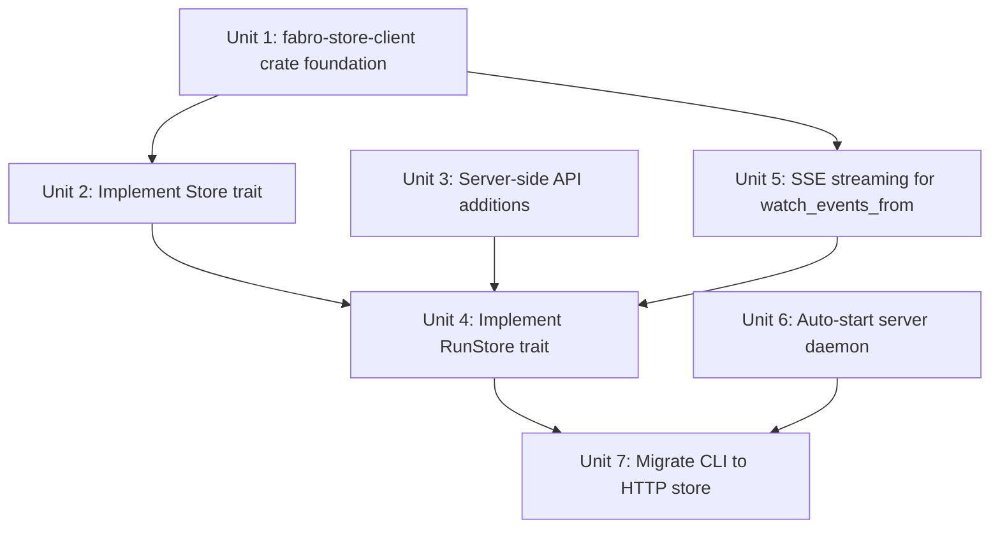

# feat: HTTP store client with CLI auto-start

## Overview

Replace direct SlateDB access from CLI processes with an HTTP-backed `Store`/`RunStore` implementation that routes all operations through the `fabro server` over a Unix socket. Add transparent auto-start so the server daemon launches on demand when any CLI command needs store access.

## Problem Frame

Currently every CLI command opens its own `SlateStore` via `build_store()` (~25 call sites). This means each process opens its own SlateDB instance, creating contention, reader polling latency, and multiple database handles. The consolidation to a single SlateDB instance owned by the server requires all CLI store access to go through HTTP.

Without auto-start, requiring a running server for every CLI command would be a DX regression. The server daemon infrastructure (start/stop/status, flock locking, readiness polling) is already complete.

**Assumption:** Events-First Server Architecture is already complete. Events are the sole write path, the server materializes state from events, and SSE pushes events to subscribers.

## Requirements Trace

- R1. An HTTP-backed `Store` + `RunStore` implementation connects to the server over Unix socket
- R2. CLI auto-starts the server daemon when store access is needed and no server is running
- R3. All ~25 CLI `build_store()` call sites transparently switch to the HTTP-backed store
- R4. `watch_events_from` returns a live `Stream` via SSE subscription
- R5. `InMemoryStore` tests are completely unaffected
- R6. Binary assets transfer efficiently over HTTP (raw bytes, not base64)
- R7. Clear error messages when server fails to start or becomes unreachable mid-operation

## Scope Boundaries

- Server-side Events-First architecture (assumed complete)
- Web UI or TypeScript API client changes (separate concern)
- Cloud/S3 object store configuration (orthogonal)
- Changes to the `RunStore` trait interface (trait stays as-is; the HTTP client implements it fully)
- Removing the `SlateStore` implementation (kept for server-internal use)

## Context & Research

### Relevant Code and Patterns

- `lib/crates/fabro-store/src/lib.rs` -- `Store` (5 methods) and `RunStore` (~53 methods) trait definitions
- `lib/crates/fabro-store/src/memory.rs` -- `InMemoryStore` reference impl using BTreeMap
- `lib/crates/fabro-cli/src/store.rs` -- `build_store()` factory, returns `Arc<SlateStore>`
- `lib/crates/fabro-cli/src/commands/server/record.rs` -- `ServerRecord`, `active_server_record()`, path helpers
- `lib/crates/fabro-cli/src/commands/server/start.rs` -- `execute_daemon()`, `acquire_lock()`, `try_connect()`, readiness polling
- `lib/crates/fabro-server/src/server.rs` -- Axum router, existing REST + SSE endpoints
- `lib/crates/fabro-server/src/bind.rs` -- `Bind` enum (Unix | Tcp)
- `lib/crates/fabro-llm/src/providers/fabro_server.rs` -- existing pattern for consuming SSE from server (LineReader + parse_sse_block)
- `lib/crates/fabro-store/src/types.rs` -- `RunSnapshot`, `EventEnvelope`, `EventPayload`, `RunSummary`

### Institutional Learnings

No `docs/solutions/` exists. Key codebase patterns serve as institutional knowledge:
- Launcher/ServerRecord pattern for daemon discovery and stale cleanup
- SSE consumption pattern in fabro-llm (LineReader + parse_sse_block)
- All CLI commands follow the same `build_store() -> resolve_run_combined()` flow

## Key Technical Decisions

- **New crate `fabro-store-client`**: Implements `Store` + `RunStore` over HTTP. Separate crate avoids circular dependencies (depends on `fabro-store` for traits and `hyper`/`http-body-util` for HTTP transport; does NOT depend on `fabro-server` or `fabro-cli`).

- **hyper over Unix socket, not reqwest**: Use `hyper` + `hyper-util` + `tokio::net::UnixStream` directly for the Unix socket transport. `reqwest` doesn't natively support Unix sockets. This is a deliberate divergence from the codebase pattern where `reqwest` is used in 17 crates for TCP HTTP — justified because Unix socket transport requires a lower-level connector, and the client only talks to one known server (no redirects, cookies, or TLS needed). The SSE parser in `fabro-llm` (`LineReader`) is built on `reqwest::Response` — the new SSE module must implement its own parser over hyper's byte stream rather than reusing `LineReader` directly.

- **Coarse-grained API, not trait mirroring**: The server exposes a small set of endpoints. The `HttpRunStore` translates between the fine-grained trait and the coarse API:
  - **Reads (snapshot-covered)**: `GET /api/v1/runs/{id}/snapshot` returns full `RunSnapshot`. Methods covered: `get_run`, `get_start`, `get_status`, `get_checkpoint`, `get_conclusion`, `get_retro`, `get_graph`, `get_sandbox`, `get_node`, `list_node_visits`, `list_node_ids`, `get_final_patch`, `get_pull_request`.
  - **Reads (dedicated endpoints needed)**: `RunSnapshot` does NOT include: `retro_prompt`, `retro_response`, artifacts, assets, events, or checkpoint history. These need dedicated GET endpoints: `GET /runs/{id}/retro-prompt`, `GET /runs/{id}/artifacts`, `GET /runs/{id}/assets`, `GET /runs/{id}/events` (JSON), `GET /runs/{id}/checkpoints`.
  - **Writes**: `POST /api/v1/runs/{id}/events` for event append. Other write methods forward as typed store operations to a generic `POST /api/v1/runs/{id}/store` endpoint.
  - **Streaming**: `GET /api/v1/runs/{id}/events` SSE for `watch_events_from`.

- **`create_run` vs `start_run` endpoint distinction**: The existing `POST /api/v1/runs` endpoint (`start_run`) starts a full workflow execution. The `Store::create_run` trait method is a lower-level catalog operation. Unit 3 must add a store-level create endpoint (e.g., `POST /api/v1/store/runs`) distinct from the workflow-level start endpoint.

- **Authentication bypass for local Unix socket**: When the server is auto-started for local daemon mode, it uses `AuthMode::Disabled`. The HTTP store client does not send auth headers. This is safe because Unix sockets are local-only and filesystem permissions control access.

- **`open_run` is lightweight**: `HttpStore::open_run(run_id)` just constructs an `HttpRunStore` with the run_id and shared HTTP client. No server round trip needed — existence check happens lazily on first operation (404 → `Ok(None)` at the Store level).

- **`open_run` and `open_run_reader` return the same type**: No Writer/Reader distinction in the HTTP model. Both return `HttpRunStore`. The server decides write permissions internally.

- **Auto-start reuses existing daemon infrastructure**: `ensure_server_running()` is a sibling function to `execute_daemon()`, not a refactoring of it. Shared logic: acquire_lock, spawn child with `pre_exec_setsid`, try_connect readiness polling. Distinct behavior: does NOT bail on "already running" (that's the success fast path), does NOT rotate logs (the running server's logs are fine), does NOT print "Server started..." to stderr (prints "Starting server..." instead for DX).

- **`server` feature becomes effectively required**: `ensure_server_running` depends on `fabro-server` (for `Bind`, `ServeArgs`), which is gated behind `fabro-cli`'s optional `server` feature. Since `get_or_start_store` calls `ensure_server_running`, all CLI commands that use the store now require the `server` feature. This is acceptable — the `server` feature should be enabled by default in the CLI binary build.

- **Auto-start is in `fabro-cli`, not in `fabro-store-client`**: The HTTP store client is transport-only. It doesn't know about daemons, flock, or process management. The CLI's `store.rs` orchestrates: check server → auto-start → create `HttpStore`.

## Open Questions

### Resolved During Planning

- **Where does auto-start live?** In `fabro-cli/src/commands/server/start.rs` as a new `ensure_server_running()` function, called from `fabro-cli/src/store.rs`. The store client crate is purely transport.
- **How does the client discover the socket?** Reads `ServerRecord.bind` from `server.json`. Same discovery mechanism as `server status`/`server stop`.
- **Should the client cache snapshot data?** Yes, per-request. A single CLI command (e.g., `fabro runs inspect`) may call multiple `get_*` methods. Fetch snapshot once, serve subsequent reads from cache. No cross-command caching.

### Deferred to Implementation

- Exact set of server endpoints needed vs what events-first already provides (inventory during Unit 3)
- Whether `POST /api/v1/runs/{id}/store` generic write endpoint is better than individual write endpoints (decide based on actual write patterns the CLI uses)
- HTTP client connection timeout and retry values
- Whether `hyper` or a lighter HTTP approach (raw HTTP/1.1 over `tokio::io`) is the right fit — start with hyper, simplify if warranted. Do NOT consider `ureq` — it is a blocking client incompatible with the async `RunStore` trait and SSE streaming

## High-Level Technical Design

> *This illustrates the intended approach and is directional guidance for review, not implementation specification. The implementing agent should treat it as context, not code to reproduce.*

```
CLI command (e.g., `fabro runs list`)
    |
store::get_or_start_store(storage_dir)
    |
    ├── record::active_server_record(storage_dir)
    │   ├── Some(record) → server is running
    │   └── None → ensure_server_running(storage_dir)
    │              ├── acquire_lock(server.lock)
    │              ├── re-check active_server_record (may have started between checks)
    │              ├── execute_daemon (spawn fabro server __serve ...)
    │              ├── poll try_connect(fabro.sock)
    │              └── return bind address
    |
    ├── HttpStore::connect(socket_path)
    │   └── creates hyper client with Unix socket connector
    |
    └── return Arc<dyn Store>
         |
    store.list_runs(query)
         |
    HttpStore → GET /api/v1/runs?start=...&end=...
         |
    server (Axum) → SlateStore.list_runs(query) → response
         |
    HttpStore ← JSON response → Vec<RunSummary>
```

```
watch_events_from(seq) flow:

HttpRunStore → GET /api/v1/runs/{id}/events?from={seq} (Accept: text/event-stream)
    |
Server → SSE stream (broadcast channel + catch-up from store)
    |
HttpRunStore ← parse SSE blocks → yield EventEnvelope items
    |
Returns Pin<Box<dyn Stream<Item = Result<EventEnvelope>> + Send>>
```



Units 1, 3, and 6 can start in parallel. Unit 2 depends on 1. Unit 5 depends on 1. Unit 4 depends on 1, 2, 3, and 5. Unit 7 depends on 4 and 6.

## Implementation Units

- [ ] **Unit 1: Create fabro-store-client crate with Unix socket HTTP foundation**

**Goal:** New crate with an HTTP client that communicates over Unix sockets. Provides typed request helpers the Store/RunStore impls will build on.

**Requirements:** R1

**Dependencies:** None

**Files:**
- Create: `lib/crates/fabro-store-client/Cargo.toml`
- Create: `lib/crates/fabro-store-client/src/lib.rs`
- Create: `lib/crates/fabro-store-client/src/http.rs`
- Modify: `lib/crates/fabro-store/src/error.rs` (add `Http`/`Transport` variant to `StoreError`)
- Test: `lib/crates/fabro-store-client/tests/it/main.rs`

Note: No workspace `Cargo.toml` modification needed — the `lib/crates/*` glob member pattern already covers the new crate.

**Approach:**
- `HttpClient` struct holds a hyper client configured for Unix socket transport and the socket path
- `HttpClient::connect(socket_path: PathBuf) -> Self` constructor
- Helper methods: `get<T: DeserializeOwned>(&self, path) -> Result<T>`, `post<T, R>(&self, path, body: &T) -> Result<R>`, `delete(&self, path) -> Result<()>`, `get_bytes(&self, path) -> Result<Option<Bytes>>`, `put_bytes(&self, path, data: &[u8]) -> Result<()>`
- All helpers prepend `/api/v1` to paths
- Map HTTP status codes: 404 → Ok(None) for Option-returning endpoints, 4xx/5xx → StoreError::Http
- Map transport errors (connection refused, timeout, broken pipe) → StoreError::Transport
- Use `tokio::net::UnixStream` as the transport layer
- Add `StoreError::Http { status: u16, message: String }` and `StoreError::Transport(String)` variants to `fabro-store/src/error.rs`

**Patterns to follow:**
- `lib/crates/fabro-server/src/bind.rs` -- Bind enum for address representation
- `lib/crates/fabro-store/src/error.rs` -- existing StoreError enum for variant style

**Test scenarios:**
- Happy path: HttpClient connects to a Unix socket and makes a GET request, receives JSON response
- Happy path: POST with JSON body returns expected response
- Error path: connection refused when socket doesn't exist → clear error
- Error path: server returns 500 → mapped to StoreError
- Edge case: server returns 404 → mapped to Ok(None) for option helpers

**Verification:**
- `cargo build -p fabro-store-client` compiles
- `cargo nextest run -p fabro-store-client` passes

- [ ] **Unit 2: Implement Store trait on HttpStore**

**Goal:** `HttpStore` implements the `Store` trait, routing catalog operations (create, open, list, delete runs) through the server HTTP API.

**Requirements:** R1, R3

**Dependencies:** Unit 1

**Files:**
- Create: `lib/crates/fabro-store-client/src/store.rs`
- Modify: `lib/crates/fabro-store-client/src/lib.rs` (pub mod store, re-export HttpStore)
- Modify: `lib/crates/fabro-store-client/Cargo.toml` (add fabro-store dependency for trait defs)
- Test: `lib/crates/fabro-store-client/tests/it/store.rs`

**Approach:**
- `HttpStore` wraps `Arc<HttpClient>` and implements `Store`
- `create_run(run_id, created_at, run_dir)` → `POST /store/runs` with JSON body, returns `Arc<dyn RunStore>` (HttpRunStore). Note: this is the store-level create endpoint, distinct from the workflow-level `POST /runs` that starts execution.
- `open_run(run_id)` → constructs `HttpRunStore` directly (no server call; existence checked lazily)
- `open_run_reader(run_id)` → same as `open_run` (no distinction in HTTP model)
- `list_runs(query)` → `GET /runs` with query params for start/end dates, deserializes `Vec<RunSummary>`
- `delete_run(run_id)` → `DELETE /runs/{id}`
- `HttpRunStore` struct: holds `Arc<HttpClient>` + `RunId`

**Patterns to follow:**
- `lib/crates/fabro-store/src/memory.rs` -- InMemoryStore's Store impl for trait contract reference

**Test scenarios:**
- Happy path: list_runs with no filter returns deserialized run summaries
- Happy path: create_run returns an HttpRunStore that can be used for subsequent operations
- Happy path: delete_run sends DELETE and succeeds
- Edge case: open_run for non-existent run — first operation on the HttpRunStore returns None/error (lazy check)
- Error path: server unreachable → StoreError with clear message

**Verification:**
- `cargo nextest run -p fabro-store-client` passes
- HttpStore satisfies `Store: Send + Sync` bounds

- [ ] **Unit 3: Server-side API endpoint additions**

**Goal:** Add server endpoints that the HTTP store client needs but don't exist yet. Update OpenAPI spec.

**Requirements:** R1, R6

**Dependencies:** None (parallel with Units 1-2)

**Files:**
- Modify: `lib/crates/fabro-server/src/server.rs` (add handlers and routes)
- Modify: `docs/api-reference/fabro-api.yaml` (add endpoint specs)
- Test: `lib/crates/fabro-server/tests/it/api.rs`

**Approach:**
- Inventory the existing endpoints against what the HTTP client needs. Known gaps (verify at implementation time):
  - `POST /api/v1/store/runs` — store-level create_run (distinct from existing `POST /api/v1/runs` which starts a full workflow execution). Takes `run_id`, `created_at`, `run_dir`
  - `DELETE /api/v1/runs/{id}` — delete a run (calls `store.delete_run`)
  - `GET /api/v1/runs/{id}/snapshot` — returns full `RunSnapshot` as JSON
  - `GET /api/v1/runs/{id}/events` with `Accept: application/json` — returns `Vec<EventEnvelope>` as JSON (vs SSE for `text/event-stream`). Support `?from={seq}` query param
  - `POST /api/v1/runs/{id}/events` — append an `EventPayload`, returns the assigned sequence number
  - `POST /api/v1/runs/{id}/rewind` — calls `reset_for_rewind`
  - `GET /api/v1/runs/{id}/retro-prompt` — returns retro prompt text (not in RunSnapshot)
  - `GET /api/v1/runs/{id}/retro-response` — returns retro response text (not in RunSnapshot)
  - `GET /api/v1/runs/{id}/artifacts` — lists artifact values (not in RunSnapshot)
  - `GET /api/v1/runs/{id}/artifacts/{id}` — gets single artifact value
  - `GET /api/v1/runs/{id}/checkpoints` — lists checkpoint history (not in RunSnapshot)
  - `PUT /api/v1/runs/{id}/assets/{node_id}/{visit}/{filename}` — binary body, calls `put_asset`
  - `GET /api/v1/runs/{id}/assets/{node_id}/{visit}/{filename}` — returns raw bytes, calls `get_asset`
  - `GET /api/v1/runs/{id}/assets` — lists all assets
  - `POST /api/v1/runs/{id}/store` — generic write endpoint for put_* methods not covered by events
- Content negotiation on `/events`: `Accept: text/event-stream` → SSE (existing behavior), `Accept: application/json` → JSON array
- Asset endpoints use `application/octet-stream` content type for binary transfer (R6)
- Add to OpenAPI spec, rebuild types: `cargo build -p fabro-api-types`

**Patterns to follow:**
- Existing handlers in `server.rs` (e.g., `get_run_status`, `get_checkpoint`, `get_graph`)
- `extract::Path(run_id)` + `State(state)` pattern for route handlers
- `AppState.store` for store access

**Test scenarios:**
- Happy path: DELETE /runs/{id} removes the run, subsequent GET returns 404
- Happy path: GET /runs/{id}/snapshot returns complete RunSnapshot JSON
- Happy path: POST /runs/{id}/events appends event and returns sequence number
- Happy path: GET /runs/{id}/events with Accept: application/json returns JSON array
- Happy path: PUT then GET asset round-trips binary data correctly
- Happy path: POST /runs/{id}/rewind resets the run state
- Edge case: DELETE /runs/{nonexistent} returns 404
- Edge case: GET /runs/{id}/events?from=5 returns only events with seq >= 5
- Edge case: PUT asset with empty body succeeds (zero-length asset)

**Verification:**
- `cargo nextest run -p fabro-server` passes
- `cargo build -p fabro-api-types` regenerates without errors
- OpenAPI spec validates

- [ ] **Unit 4: Implement RunStore trait on HttpRunStore**

**Goal:** `HttpRunStore` implements the full `RunStore` trait, mapping ~48 methods to server HTTP endpoints.

**Requirements:** R1, R6

**Dependencies:** Units 1, 2, 3, 5

**Files:**
- Create: `lib/crates/fabro-store-client/src/run_store.rs`
- Modify: `lib/crates/fabro-store-client/src/lib.rs`
- Test: `lib/crates/fabro-store-client/tests/it/run_store.rs`

**Approach:**
- **Read methods** (`get_*`): fetch `RunSnapshot` via `GET /runs/{id}/snapshot`, cache it in an `OnceCell` or `Mutex<Option<RunSnapshot>>` on the `HttpRunStore`. Individual `get_run`, `get_status`, `get_checkpoint`, `get_node`, etc. extract from the cached snapshot. Targeted endpoints for frequently-changing data: `get_status` → `GET /runs/{id}` (status endpoint already exists), event listing → `GET /runs/{id}/events`
- **Write methods** (`put_*`): forward to server. Two approaches to evaluate:
  - (a) Generic: `POST /runs/{id}/store` with `{ "op": "put_status", "data": {...} }`
  - (b) Event-based: translate the put into the corresponding event and `POST /runs/{id}/events`
  - Decision deferred to implementation — start with (a) for simplicity since events-first handles the actual persistence
- **Node methods**: `get_node(NodeVisitRef)` extracts from snapshot. `list_node_visits`, `list_node_ids` likewise
- **Event methods**: `append_event` → `POST /runs/{id}/events`. `list_events` / `list_events_from` → `GET /runs/{id}/events?from={seq}` (JSON mode). `watch_events_from` → delegates to SSE stream (Unit 5)
- **Asset methods**: `put_asset` → `PUT /runs/{id}/assets/{node}/{visit}/{filename}` (raw bytes). `get_asset` → `GET /runs/{id}/assets/{node}/{visit}/{filename}`. `list_assets` / `list_all_assets` → `GET /runs/{id}/assets`
- **Artifact methods**: `put_artifact_value` / `get_artifact_value` / `list_artifact_values` → can use snapshot for reads, POST for writes
- **`reset_for_rewind`** → `POST /runs/{id}/rewind`
- **`get_snapshot`** → `GET /runs/{id}/snapshot` (same as the caching endpoint, but returns the full value)
- Invalidate snapshot cache after any write operation

**Patterns to follow:**
- `lib/crates/fabro-store/src/memory.rs` -- InMemoryStore's RunStore impl as trait contract reference
- `lib/crates/fabro-store/src/types.rs` -- RunSnapshot, NodeSnapshot field structure

**Test scenarios:**
- Happy path: get_status returns deserialized RunStatusRecord from server
- Happy path: put_status sends to server and subsequent get_status reflects the change
- Happy path: append_event returns sequence number
- Happy path: list_events_from(5) returns only events with seq >= 5
- Happy path: get_node returns correct NodeSnapshot for a given visit
- Happy path: put_asset / get_asset round-trips binary data
- Happy path: get_snapshot returns full RunSnapshot
- Edge case: get_checkpoint when no checkpoint exists returns None
- Edge case: snapshot cache is invalidated after a write
- Error path: server returns 500 on write → StoreError propagated

**Verification:**
- `cargo nextest run -p fabro-store-client` passes
- HttpRunStore satisfies `RunStore: Send + Sync` bounds

- [ ] **Unit 5: SSE streaming for watch_events_from**

**Goal:** Implement `watch_events_from` by subscribing to the server's SSE event stream, returning a `Pin<Box<dyn Stream>>`.

**Requirements:** R4

**Dependencies:** Unit 1

**Files:**
- Create: `lib/crates/fabro-store-client/src/sse.rs`
- Test: `lib/crates/fabro-store-client/tests/it/sse.rs`

Note: Wiring `sse::subscribe_events` into `HttpRunStore::watch_events_from` happens in Unit 4 (which owns `run_store.rs`), not here.

**Approach:**
- `subscribe_events(client, run_id, from_seq) -> impl Stream<Item = Result<EventEnvelope>>`
- Opens HTTP connection to `GET /runs/{id}/events?from={seq}` with `Accept: text/event-stream`
- Implements its own SSE parser over hyper's byte stream (cannot reuse `LineReader` from `fabro-llm` which is tied to `reqwest::Response`)
- Parses SSE format: `data:` lines containing JSON `EventEnvelope`, delimited by `\n\n`
- Returns an async `Stream` that yields deserialized `EventEnvelope` items
- Stream ends when server closes the connection (run completed) or on error
- Reconnection logic: if connection drops unexpectedly, reconnect from last seen sequence number

**Patterns to follow:**
- `lib/crates/fabro-llm/src/providers/common.rs` -- `LineReader` + `parse_sse_block` as a reference for SSE parsing logic (but implemented over hyper byte stream, not reqwest)
- `lib/crates/fabro-server/src/server.rs` get_events handler -- the server-side SSE format to match

**Test scenarios:**
- Happy path: subscribe to event stream, receive events in order, each deserializes to EventEnvelope
- Happy path: stream ends cleanly when server closes connection
- Edge case: from_seq > 0 skips earlier events
- Edge case: reconnect after connection drop resumes from last sequence
- Error path: invalid SSE data → StoreError in stream item

**Verification:**
- `cargo nextest run -p fabro-store-client` passes
- Stream satisfies `Pin<Box<dyn Stream<Item = Result<EventEnvelope>> + Send>>` return type

- [ ] **Unit 6: Auto-start server daemon**

**Goal:** Add `ensure_server_running()` that starts the server daemon if not already running, reusing existing infrastructure. Returns the socket path for the HTTP client.

**Requirements:** R2, R7

**Dependencies:** None (parallel with Units 1-5)

**Files:**
- Modify: `lib/crates/fabro-cli/src/commands/server/start.rs` (extract `ensure_server_running`)
- Test: `lib/crates/fabro-cli/tests/it/cmd/server_start.rs` (add auto-start tests)

**Approach:**
- Extract a `pub(crate) fn ensure_server_running(storage_dir: &Path) -> Result<Bind>` from `execute_daemon`:
  1. Check `active_server_record(storage_dir)` — if running, return `record.bind` immediately (the success case)
  2. Acquire flock on `server.lock`
  3. Re-check `active_server_record` (another process may have started the server between step 1 and lock acquisition)
  4. If still not running, call `execute_daemon` logic (spawn child, write record, poll readiness)
  5. Return the bind address
- Key difference from `execute_daemon`: does NOT bail on "already running" — that's the fast path
- On failure: return error with message "Failed to start server: {reason}. Start manually with `fabro server start`"
- The function is idempotent and race-safe (flock serializes concurrent callers)

**Patterns to follow:**
- `lib/crates/fabro-cli/src/commands/server/start.rs` -- `execute_daemon()` for the full spawn + readiness logic
- `lib/crates/fabro-cli/src/commands/server/record.rs` -- `active_server_record()` for discovery

**Test scenarios:**
- Happy path: ensure_server_running when server is already running returns bind address immediately
- Happy path: ensure_server_running when server is not running starts it and returns bind address
- Happy path: concurrent calls to ensure_server_running — only one starts the daemon, others wait and find it running
- Edge case: stale server record (dead PID) — cleaned up, fresh server started
- Error path: server fails to start — clear error message suggesting manual start

**Verification:**
- `cargo nextest run -p fabro-cli` passes
- Manual: running a CLI command without a server auto-starts one

- [ ] **Unit 7: Migrate CLI to HTTP-backed store**

**Goal:** Replace `build_store()` with `get_or_start_store()` that returns an HTTP-backed store connected through the server. All ~25 CLI call sites get the new behavior.

**Requirements:** R2, R3, R4, R5, R7

**Dependencies:** Units 4, 5, 6

**Files:**
- Modify: `lib/crates/fabro-cli/src/store.rs` (new `get_or_start_store`, keep `build_store` for server-internal use)
- Modify: `lib/crates/fabro-cli/Cargo.toml` (add fabro-store-client dependency)
- Modify: ~25 CLI command files (change `build_store` calls to `get_or_start_store`)
- Test: `lib/crates/fabro-cli/tests/it/scenario/` (integration test for CLI-through-server flow)

**Approach:**
- New function `pub(crate) async fn get_or_start_store(storage_dir: &Path) -> Result<Arc<dyn Store>>`:
  1. Call `ensure_server_running(storage_dir)` → get bind address
  2. Extract socket path from `Bind::Unix(path)` (error if TCP — auto-start always uses Unix socket)
  3. Construct `HttpStore::connect(socket_path)`
  4. Return as `Arc<dyn Store>`
- Keep `build_store()` as `pub(crate)` for server-internal use (the server still opens SlateDB directly)
- Rename to make the distinction clear: `build_local_store()` (server use) vs `get_or_start_store()` (CLI use)
- `open_run_reader()` helper in store.rs also migrates to use `get_or_start_store`
- All CLI call sites: mechanical replacement of `store::build_store(&storage_dir)?` → `store::get_or_start_store(&storage_dir).await?`
  - All ~25 callers are already in `async fn` contexts, so the migration is adding `.await` at each site. No `block_on()` needed.

**Patterns to follow:**
- Current `build_store()` usage pattern across all CLI commands
- `lib/crates/fabro-cli/src/commands/server/start.rs` -- daemon management functions

**Test scenarios:**
- Happy path: `fabro runs list` with no running server auto-starts server and returns results
- Happy path: `fabro runs list` with running server connects and returns results (no extra start)
- Happy path: `fabro run logs <id>` streams events via SSE through the server
- Integration: full lifecycle — auto-start → create run → list runs → inspect run → delete run
- Error path: server fails to auto-start — CLI prints clear error with suggestion
- Edge case: multiple CLI commands in quick succession — first starts server, subsequent reuse it

**Verification:**
- `cargo nextest run -p fabro-cli` passes (including existing tests)
- `cargo clippy --workspace -- -D warnings` clean
- Manual: `fabro server stop && fabro runs list` auto-starts and succeeds

## System-Wide Impact

- **Interaction graph:** `build_store()` in `fabro-cli/src/store.rs` is the sole injection point for store access in all CLI commands. Replacing it with `get_or_start_store()` transparently routes all ~25 commands through the server. The server's `serve.rs` constructs its own `SlateStore` inline (not via `build_store`) — no change to server internals. The `build_store` function in `fabro-cli` is renamed to `build_local_store` to clarify it's only for server-internal use.
- **Error propagation:** HTTP errors from the store client propagate as `StoreError` through existing error handling. New `StoreError::Http` and `StoreError::Transport` variants (Unit 1) carry structured error context. Auto-start failures include actionable messages.
- **State lifecycle risks:** The server process may crash between CLI operations. The HTTP client should handle connection errors gracefully (not panic). The auto-start function is idempotent — re-running after a crash starts a fresh server.
- **API surface parity:** New server endpoints (Unit 3) extend the REST API. The OpenAPI spec and `fabro-api-types` must be updated. The TypeScript API client (`fabro-api-client`) will gain these endpoints on next generation but is not required for this plan.
- **Feature flag impact:** `ensure_server_running` depends on `fabro-server` (optional dep in `fabro-cli`). Since all CLI store access routes through auto-start, the `server` feature effectively becomes required for the CLI binary. Ensure `server` is in `default` features for `fabro-cli`.
- **Integration coverage:** End-to-end tests must verify the full CLI → auto-start → HTTP → server → SlateDB path. Tests for `HttpStore`/`HttpRunStore` should use an embedded Axum test server (matching the `tower::ServiceExt::oneshot` pattern in `fabro-server/tests/it/`) backed by `InMemoryStore`.
- **Unchanged invariants:** The `Store`/`RunStore` trait interfaces are unchanged (only `StoreError` gains new variants). `InMemoryStore` is unchanged. Server-internal store access is unchanged. All existing server tests continue to use `InMemoryStore`.

## Risks & Dependencies

| Risk | Mitigation |
|------|------------|
| Server endpoint inventory incomplete — events-first may not provide all needed endpoints | Unit 3 inventories gaps at implementation time. The plan lists known gaps; additional ones are handled as they're discovered |
| Unix socket HTTP client adds latency vs direct SlateDB | Benchmark critical paths (list_runs, watch_events). Unix socket IPC is typically <1ms overhead. Snapshot caching reduces round trips |
| Auto-start adds ~1-2s to first CLI command in a session | Acceptable tradeoff. Subsequent commands are instant. Print "Starting server..." to stderr so user knows what's happening |
| Concurrent CLI commands during auto-start race | flock serializes. Second caller waits for lock, then finds server running. Already proven in daemon management |
| Large RunSnapshot for runs with many nodes/events | Snapshot endpoint should support partial responses in the future. For now, full snapshot is acceptable — most runs are <10MB |
| CLI commands that are currently sync need async for HTTP | `build_store()` is currently sync (`fn`, not `async fn`). `get_or_start_store()` is async. All ~25 callers already run inside a tokio runtime (CLI entry point sets up runtime). The migration is mechanical: add `.await` at each call site. Do NOT use `block_on()` inside an async context (will panic) — instead ensure each caller is already in an async fn |
| `server` feature becomes effectively mandatory | Acceptable — make it a default feature for the CLI binary. Non-server builds (e.g., embedded use) can opt out |

## Sources & References

- **Origin document:** [docs/ideation/2026-04-02-slatedb-consolidation-ideation.md](docs/ideation/2026-04-02-slatedb-consolidation-ideation.md)
- Related plan: [docs/plans/2026-04-02-001-feat-server-daemon-management-plan.md](docs/plans/2026-04-02-001-feat-server-daemon-management-plan.md) (completed — this plan builds on it)
- Related code: `lib/crates/fabro-store/src/lib.rs` (Store + RunStore traits)
- Related code: `lib/crates/fabro-cli/src/store.rs` (build_store factory)
- Related code: `lib/crates/fabro-cli/src/commands/server/` (daemon management)
- Related code: `lib/crates/fabro-server/src/server.rs` (API handlers)
- Related docs: `docs-internal/events-strategy.md` (event system architecture)
