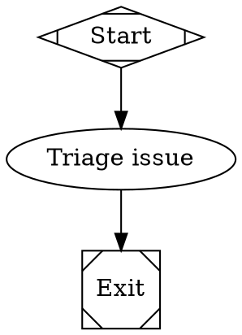

GitHub issue intake turns labeled issues into Fabro runs. Use it when GitHub is where work is filed, triaged, or approved, and you want a developer to start automation by applying a label instead of copying issue context into a run form.

When a matching label is added to an issue, Fabro creates and starts a run for the automation's target workflow. The run is linked back to the issue, receives the issue details as workflow inputs, and can optionally post a status comment on the issue.

## Prerequisites

- Fabro is running with the [GitHub App strategy](/integrations/github#github-app-mode)
- The GitHub App is installed on the repository that owns the issues
- `GITHUB_APP_WEBHOOK_SECRET` is configured in the server vault
- A [webhook delivery strategy](/integrations/github#webhook-delivery-strategies) makes `POST /api/v1/webhooks/github` reachable from GitHub
- The GitHub App subscribes to the **Issues** webhook event in GitHub's app settings

The GitHub App also needs Issues write permission when you enable issue comments. The installer-created app already requests that permission.

## Create an intake automation

Create an automation whose target points at the repository, branch, and workflow that should handle the issue. Then add a `github_issue` trigger.

```json title="POST /api/v1/automations"
{
  "id": "issue-intake",
  "name": "Issue intake",
  "description": "Turn labeled GitHub issues into Fabro runs.",
  "target": {
    "repository": "acme/widgets",
    "ref": "main",
    "workflow": "issue-intake"
  },
  "triggers": [
    {
      "id": "from-github-issue",
      "type": "github_issue",
      "enabled": true,
      "trigger_label": "fabro",
      "issue_label": "Bug",
      "comment": true
    }
  ]
}
```

You can also create the same trigger from the web app by opening **Automations > New automation**, enabling **GitHub issue label trigger**, and filling in the trigger label.

| Field | Purpose |
|---|---|
| `trigger_label` | The label that starts the automation when added to an issue |
| `issue_label` | Optional extra label filter; the issue must also have this label |
| `comment` | Whether Fabro comments when it starts or cannot start the run; defaults to `true` |

Fabro starts at most one run per automation, trigger, repository, and issue while the trigger label remains on the issue. Remove and re-add the trigger label to start another run for the same issue.

Pull requests are ignored even though GitHub delivers them through the same Issues webhook family.

## Use Issue Inputs

Issue-triggered runs receive these inputs:

| Input | Value |
|---|---|
| `github_issue_url` | Browser URL for the issue |
| `github_issue_number` | Numeric issue number |
| `github_issue_title` | Issue title |
| `github_issue_body` | Issue body, or an empty string when absent |
| `github_issue_author` | GitHub username of the issue author |
| `github_repository` | Repository slug in `owner/repo` form |
| `github_default_branch` | Repository default branch from the webhook payload |
| `github_trigger_label` | Label that matched the trigger |
| `github_delivery_id` | GitHub webhook delivery ID |

Reference those values with `{{ inputs.<name> }}` in workflow templates:



For local development, give the workflow placeholder values in `[run.inputs]` so you can run it by hand before wiring it to GitHub:

```toml title=".fabro/workflows/issue-intake/workflow.toml"
_version = 1

[workflow]
graph = "issue-intake.fabro"

[run.inputs]
github_issue_url = "https://github.com/acme/widgets/issues/123"
github_issue_number = 123
github_issue_title = "Example issue"
github_issue_body = "Describe the bug or task here."
github_issue_author = "alice"
github_repository = "acme/widgets"
github_default_branch = "main"
github_trigger_label = "fabro"
github_delivery_id = "local"
```

## Developer Workflow

1. Create or update the workflow that should handle issues.
2. Add placeholder `[run.inputs]` values and run it locally with `fabro run .fabro/workflows/issue-intake/workflow.toml`.
3. Create an automation with a `github_issue` trigger targeting that workflow.
4. Apply the trigger label to a GitHub issue.
5. Open the run from the issue comment or the Fabro runs list and inspect the generated plan, logs, and outputs.

## Troubleshooting

### Labeling an issue does not start a run

Verify that the GitHub App is installed on the repository, the app subscribes to the Issues event, and the webhook delivery reaches `POST /api/v1/webhooks/github`. The automation target repository must exactly match the webhook repository slug.

### Re-labeling does not start another run

Fabro keeps the issue's trigger cycle open while the trigger label remains applied. Remove the trigger label first, then add it again.

### No comment appears on the issue

Check that the trigger has `comment = true` and that the GitHub App installation has Issues write permission. Fabro can still start the run if comment posting fails.
